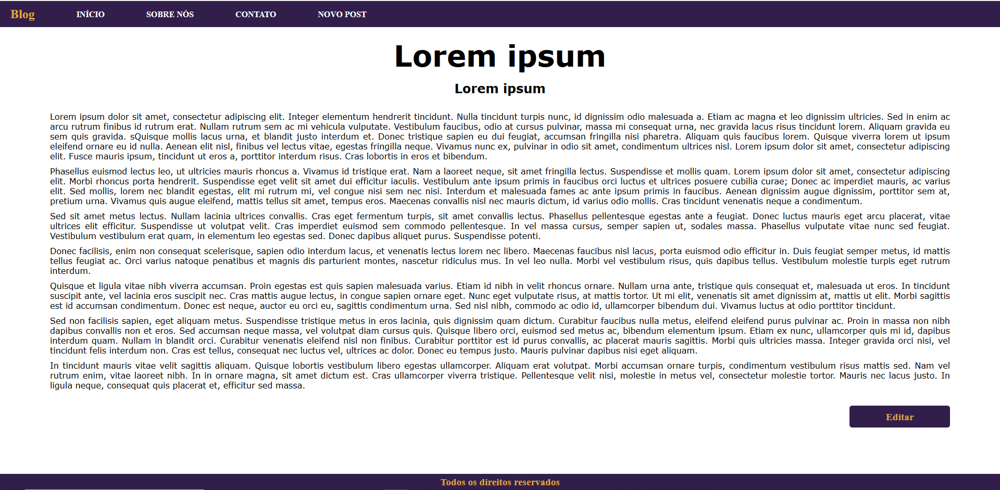
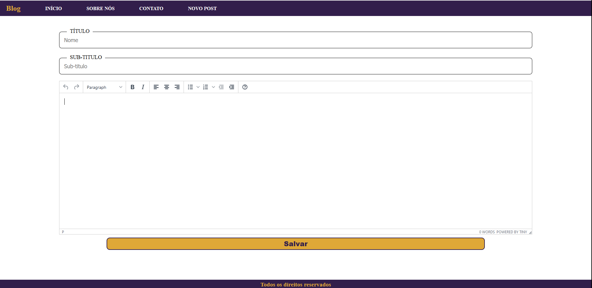
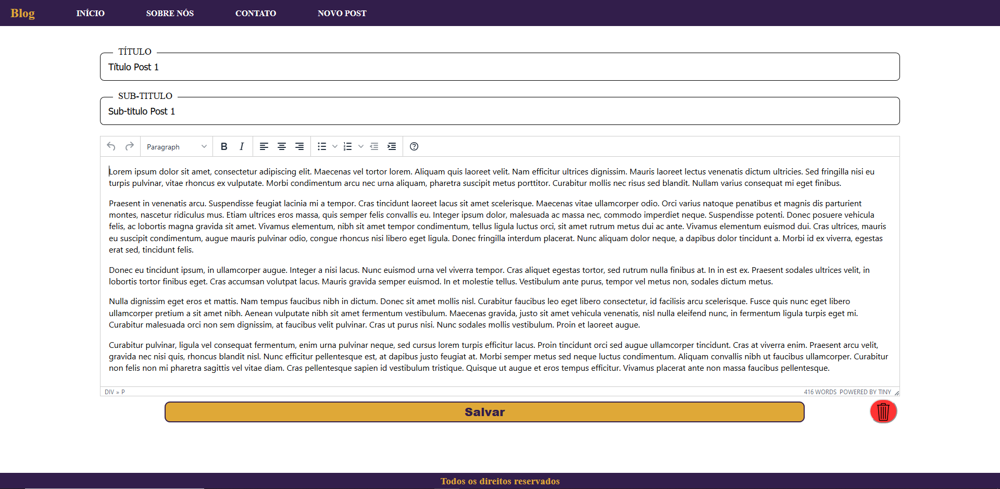

Sistema de blogs feito utilizando React, NodeJS e MongoDB com Mongoose. 

A funcionalidade da aplicação consiste em três telas. 

1- Tela Inicial: 

2- Tela do Post completo. 

3- Tela de criação/edição de post.

3.1 Tela de edição de post, preenche os campos da tela com os do post e por fim, acrescenta a opção de excluir o post específico. 

