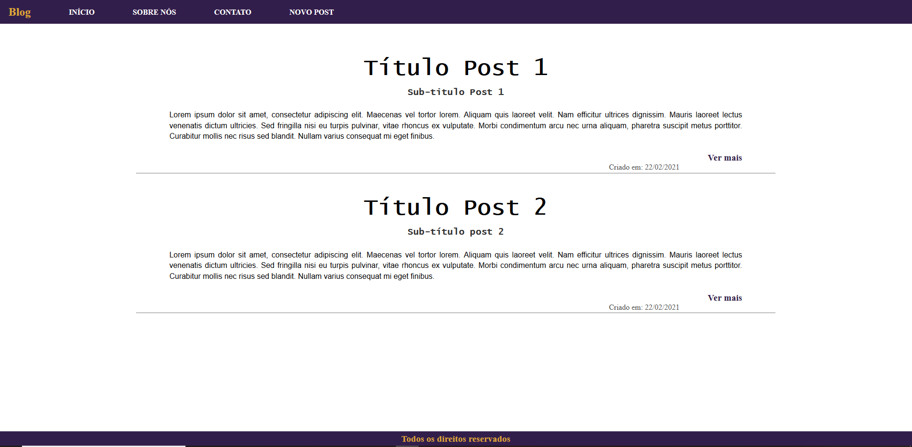
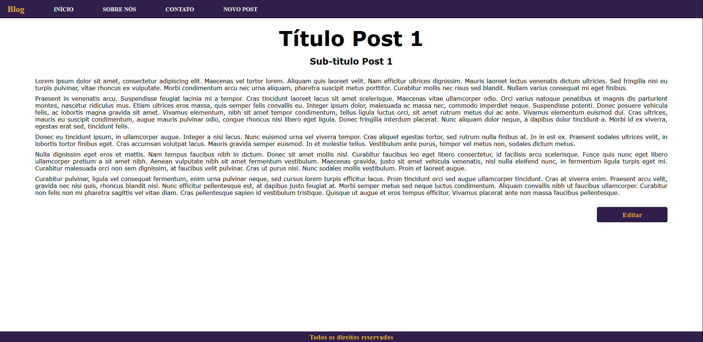

Sistema de blogs feito utilizando React, NodeJS e MongoDB com Mongoose. 

A funcionalidade da aplicação consiste em três telas. 

1- Tela Inicial: 

2- Tela do Post completo. 

3- Tela de criação/edição de post.

